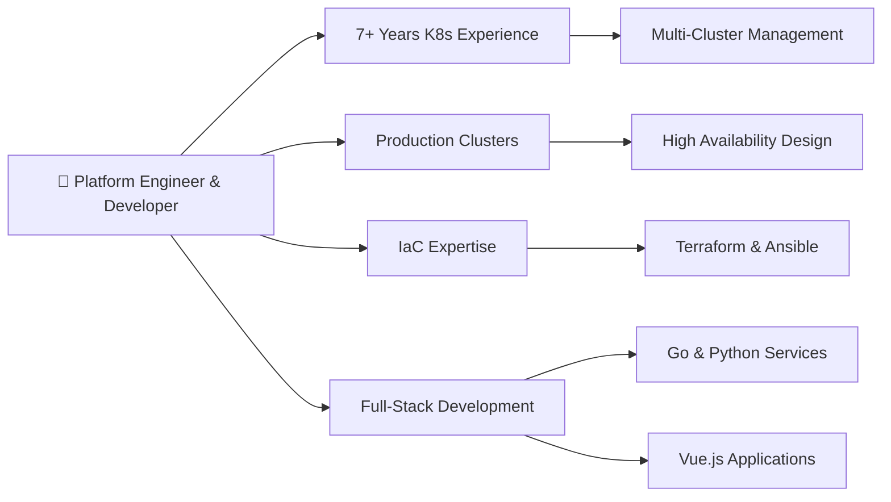

# Hi there, I'm Alex! 👋

<div align="center">


### Platform Engineer | Kubernetes Specialist | Cloud Native Enthusiast

#### Building robust, scalable platforms that empower teams and drive innovation

[](https://jelinek.website/portfolio/)
[](https://www.linkedin.com/in/alexanderjelinek/)


</div>

---

## 🚀 About Me

I'm a dedicated **Platform Engineer** with 8+ years of hands-on experience in Kubernetes and cloud-native technologies. My journey began with a curiosity for Linux and open source, but it was Kubernetes that truly ignited my passion for innovative deployment methodologies and scalable infrastructure.

**What drives me:**

- 🔧 Building robust, scalable platforms that enable teams to ship faster
- 🧩 Solving complex infrastructure puzzles (it's like a new challenge every day!)
- 📚 Continuous learning and staying ahead of cloud-native trends
- 🌱 Mentoring others and sharing knowledge within the community

---

## 🛠️ Technical Expertise

<table>
<tr>
<td width="50%" valign="top">

### **Infrastructure & Orchestration**
```yaml
kubernetes:
  experience: "3+ years"
  focus: "Production clusters, GitOps, Service Mesh"
  
container_orchestration:
  - Docker & Containerization
  - Helm Charts
  - ArgoCD / Flux
```


### **Infrastructure/Configuration as Code**


</td>
<td width="50%" valign="top">

### **Backend & Scripting**

```go
// Daily tools for automation
languages := []string{
    "Go",      // Microservices & CLI tools
    "Python",  // Automation & Data processing
    "Bash",    // System administration
}
```


### **Frontend & Web**

[](https://vuejs.org/)


</td>
</tr>
<tr>
<td width="50%" valign="top">

### **Cloud Platforms & Services**


</td>
<td width="50%" valign="top">

### **Operating Systems**


</td>
</tr>
</table>

---

## 💡 Core Competencies

<div align="center">

|    🎯 Platform Engineering    |     ☁️ Cloud Native      |  🔧 DevOps & Automation   |    🚀 Development    |
| :--------------------------: | :---------------------: | :----------------------: | :-----------------: |
|   Kubernetes Architecture    |  Hybrid-Cloud Strategy  |     CI/CD Pipelines      |    Microservices    |
| Internal Developer Platforms | Container Orchestration |  Infrastructure as Code  |   API Development   |
|       GitOps Workflows       |     Cloud Migration     | Configuration Management | Full-Stack Web Apps |
|        Observability         |    Cost Optimization    |    Automation Scripts    |  Vue.js Dashboards  |

</div>

---

## 🎯 Current Focus & Interests

<table>
<tr>
<td width="50%">

**🔭 Currently Working On:**

- Advanced Kubernetes patterns & operators
- Platform engineering best practices
- Internal developer platforms (IDPs)

**🌱 Currently Learning:**

- eBPF for observability & security
- Backstage.io & developer portals
- Advanced Go patterns

</td>
<td width="50%">

**👯 Open To Collaborate On:**

- Open-source Kubernetes operators
- Platform engineering tools
- DevOps automation projects
- Cloud-native applications

**💬 Ask Me About:**

- Kubernetes architecture & best practices
- Platform engineering strategies
- Infrastructure automation
- Cloud-native ecosystem

</td>
</tr>
</table>

---

## 🏆 Highlights & Achievements



- 🚀 **Deployed & Managed** production-grade Kubernetes clusters serving thousands of users
- 🔒 **Implemented** security best practices and compliance standards
- 📈 **Improved** platform reliability and observability metrics
- 🎓 **Continuous learner** staying current with cloud-native technologies

---

## 📊 GitHub Analytics

<div align="center">


</div>

### 📈 Contribution Activity

<div align="center">

[](https://git.io/streak-stats)

[](https://github.com/payback159)

<picture>
  <source media="(prefers-color-scheme: dark)" srcset="https://raw.githubusercontent.com/payback159/payback159/output/github-contribution-grid-snake-dark.svg">
  <source media="(prefers-color-scheme: light)" srcset="https://raw.githubusercontent.com/payback159/payback159/output/github-contribution-grid-snake.svg">
  
</picture>

</div>

### 🏅 Trophies

<div align="center">

[](https://github.com/ryo-ma/github-profile-trophy)

</div>

---

## 🤝 Let's Connect!

<div align="center">

### I'm always open to interesting conversations and opportunities

Whether you're looking to collaborate on a project, want to exchange insights on platform engineering,  
or just want to discuss the latest in cloud-native technologies - feel free to reach out!

<br>

<table>
<tr>
<td align="center" width="33%">

### 💼 Professional
[](https://jelinek.website/portfolio/)

</td>
<td align="center" width="33%">

### 🔗 Network
[](https://www.linkedin.com/in/alexanderjelinek/)

</td>
<td align="center" width="33%">

### 💬 Socials
[](https://github.com/payback159)

</td>
</tr>
</table>

---


[](https://github.com/payback159?tab=followers)
[](https://github.com/payback159?tab=repositories)

</div>

---

<div align="center">
<sub>Made with ❤️ and the help of <a href="https://github.com/anuraghazra/github-readme-stats">github-readme-stats</a></sub>
</div>
